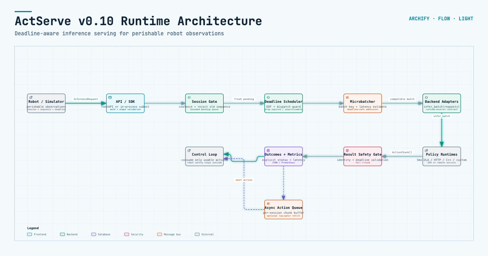

# Architecture

ActServe separates scheduling from model execution.

For an explorable view, open the
[ActServe v0.10 Archify map](architecture/README.md). The map is generated from
a versioned JSON specification, links components to public source evidence, and
includes four guided chapters for the request path, backend boundary, safe
return path, and optional asynchronous action queue.



```text
robot/simulator clients
        |
        v
InferenceRequest(session, sequence, deadline)
        |
        v
session coalescer -> EDF queue -> compatible microbatch
        |                           |
        |                           v
        |                    InferenceBackend
        |                    (any runtime/RPC)
        v                           |
RequestOutcome <------------- ActionChunk
```

## Why a robot session is not an ordinary API request

Observations become stale. If frame 42 is still queued when frame 43 arrives,
executing both can increase latency while producing an action for a world state
that no longer exists. ActServe therefore coalesces pending observations per
`(model, session_id)` and makes replacement an explicit outcome. Duplicate or
decreasing sequence numbers are rejected by default.

Deadlines are monotonic timestamps. EDF determines queue order, while a small
batching window amortizes backend overhead without intentionally waiting past the
leader's dispatch guard. An action finishing after its deadline is dropped by
default.

Backends may expose `estimate_batch_latency_ms(batch_size)`. When available,
the scheduler reserves predicted execution time before dispatch and refuses a
larger batch if it would make the earliest admitted request late.

## Backend boundary

Backends implement three members:

```python
max_batch_size: int
batch_key(request) -> Hashable
infer_batch(requests) -> Sequence[ActionChunk]
```

An optional `estimate_batch_latency_ms(batch_size)` enables deadline-aware batch
admission. It can initially be a conservative lookup table measured during warmup.

This deliberately supports local PyTorch/TensorRT code, another C++ runtime, or
a remote model server. Robot coordinate systems and action normalization belong
in explicit private or public backend adapters, not in the scheduler.

Every returned action must match the request ID, session ID, sequence number, and
model of its input slot. The whole backend call fails closed on an identity
mismatch rather than risking cross-robot action routing.
